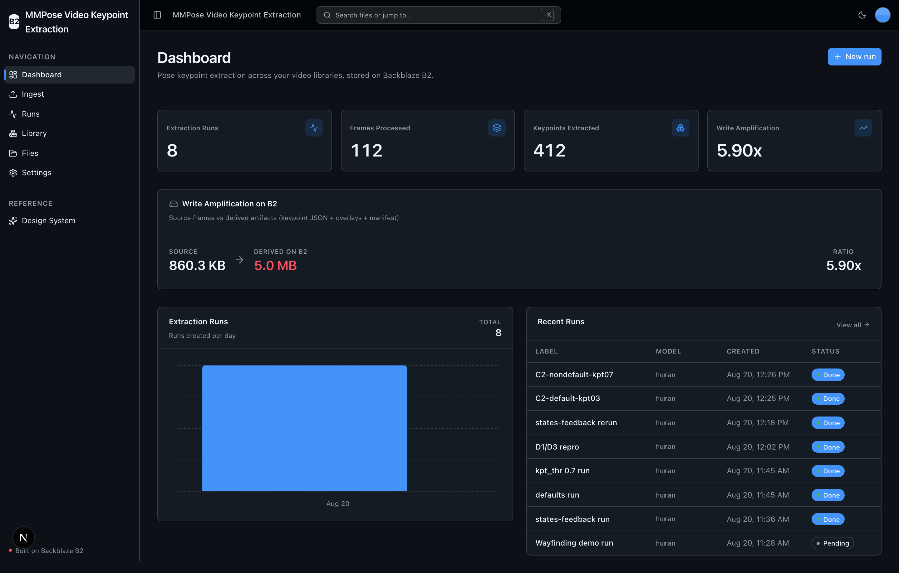
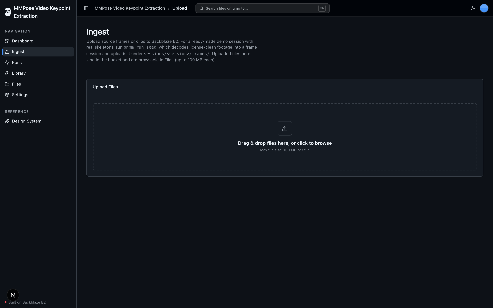
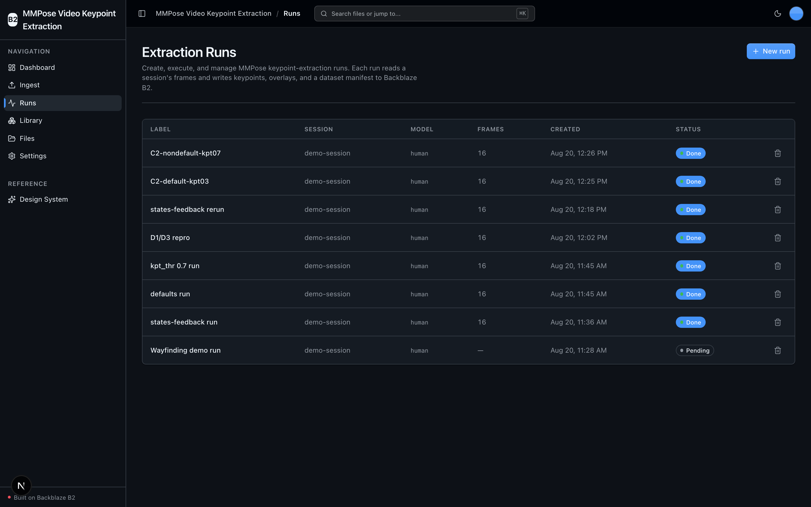
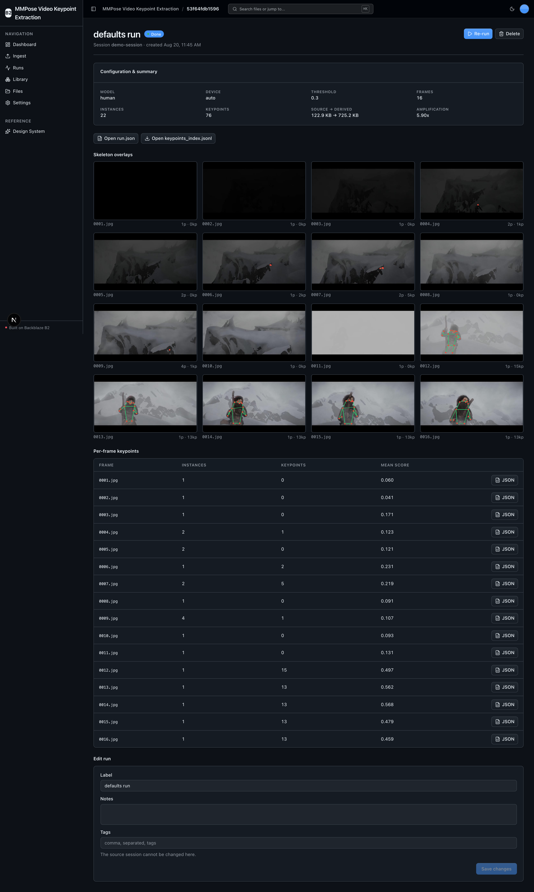
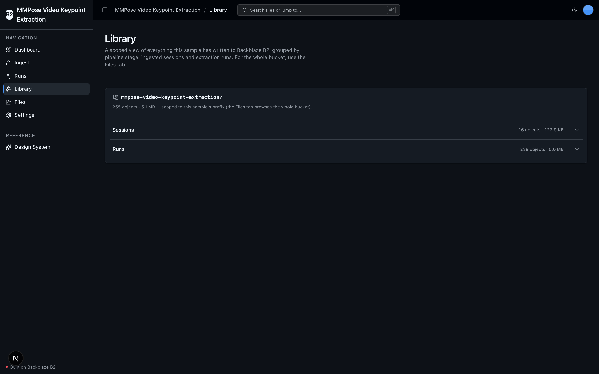

<!-- last_verified: 2026-08-20 -->
# MMPose Video Keypoint Extraction

Extract 2D/3D skeleton keypoints from large video libraries — match footage, gym
sessions, motion capture — and store every derived artifact on
**[Backblaze B2](https://www.backblaze.com/sign-up/ai-cloud-storage?utm_source=github&utm_medium=referral&utm_campaign=ai_artifacts&utm_content=b2ai-mmpose-video-keypoint-extraction)**.
Source frames are ingested to B2 by session; a local **[MMPose](https://github.com/open-mmlab/mmpose)**
engine runs per frame and writes back per-frame keypoint JSON, a skeleton-overlay
PNG, and a `keypoints_index.jsonl` dataset manifest that training and analytics
pipelines read straight from B2 over the S3-compatible API.

Built for **sports-science teams and fitness-app developers** who need pose
data at dataset scale to train pose classifiers, rep-counting models, and
biomechanical pipelines. Everything runs on local open-source models —
**B2 credentials are the only keys you need** (no second API key, $0 per demo
run beyond storage).

**What you get out of the box:**
- Full-stack UI (Next.js 16 + React 19 + Tailwind v4 + shadcn/ui): dashboard, ingest, runs, library, and a full-bucket file browser
- A real on-device MMPose engine (2D top-down + 3D lifting), CPU by default with CUDA auto-detect
- The Extraction Run entity with full lifecycle — create, read, edit, delete, and execute — persisted as a B2 manifest, no database
- FastAPI backend with a strict layered architecture, structural tests, and a checked OpenAPI contract
- Agent-optimized docs so an AI coding agent can read the repo and start contributing immediately

## What it looks like

**Dashboard** — pose keypoint metrics, the B2 write-amplification headline, a runs-per-day chart, and recent extraction runs.



**Ingest** — drag-and-drop upload of source frames and clips straight to Backblaze B2, organized by session.



**Runs** — the Extraction Run list with session, model, frame count, status, and lifecycle actions.



**Run detail** — a skeleton-overlay gallery, the per-frame keypoint table, and one-click manifest download.



**Library** — a sample-scoped view of every object written to B2, grouped into ingested sessions and extraction runs.



> **Deploy your own in one click** → [Deploy to Vercel](#deploying-to-vercel). One project, one origin.

## Quick Start

You need: Node.js >= 20, pnpm >= 9, Python >= 3.12, and a free
**[Backblaze B2 account](https://www.backblaze.com/sign-up/ai-cloud-storage?utm_source=github&utm_medium=referral&utm_campaign=ai_artifacts&utm_content=b2ai-mmpose-video-keypoint-extraction)**.
The heavy MMPose engine is an **opt-in** install (see
[Install the MMPose engine](#install-the-mmpose-engine)); the base app, its
tests, and `pnpm verify` all run without it.

### Get the code

```bash
git clone https://github.com/backblaze-b2-samples/mmpose-video-keypoint-extraction.git
cd mmpose-video-keypoint-extraction
```

### Setup

**1. Run setup**

```bash
pnpm run setup
```

This copies `.env.example` to `.env` only when `.env` does not already exist,
installs workspace dependencies, creates `services/api/.venv` if missing,
validates that an existing venv uses Python 3.12+, and installs the API's
committed base resolution from `services/api/requirements.lock`. It does **not**
install the MMPose engine (that is a separate, heavier step). It is safe to
rerun and never overwrites an existing `.env`.

> Use the `pnpm run` form: `setup` (like `doctor`) is a built-in pnpm command
> before pnpm 11, so bare `pnpm setup` would run pnpm's own command instead of
> this script.

**2. Add your B2 credentials**

Open `.env` and head to the
[Backblaze B2 dashboard](https://secure.backblaze.com/b2_buckets.htm?utm_source=github&utm_medium=referral&utm_campaign=ai_artifacts&utm_content=b2ai-mmpose-video-keypoint-extraction):

1. **Create a bucket**, then set:
   - **Bucket Unique Name** → `B2_BUCKET_NAME`
   - the bucket's **region** (e.g. `us-west-004`) → `B2_REGION` *(the S3 endpoint is derived from it — nothing to paste)*
2. **Create an application key** with `Read and Write` permission:
   - **keyID** → `B2_APPLICATION_KEY_ID`
   - **applicationKey** → `B2_APPLICATION_KEY` *(only shown once — paste it now)*

> Walkthroughs: [creating a bucket](https://www.backblaze.com/docs/cloud-storage-create-and-manage-buckets?utm_source=github&utm_medium=referral&utm_campaign=ai_artifacts&utm_content=b2ai-mmpose-video-keypoint-extraction) and [creating app keys](https://www.backblaze.com/docs/cloud-storage-create-and-manage-app-keys?utm_source=github&utm_medium=referral&utm_campaign=ai_artifacts&utm_content=b2ai-mmpose-video-keypoint-extraction).

**3. Run it**

```bash
pnpm dev
```

Frontend at `localhost:3000`, API at `localhost:8000`. Interactive API docs
(Swagger UI) are at `localhost:8000/docs`, ReDoc at `/redoc`. `pnpm dev` runs
the `pnpm run doctor` preflight first — it catches wrong Node/Python versions, a
missing venv, missing or placeholder `.env`, and busy ports.

### Install the MMPose engine

The engine (torch + mmcv + mmdet + mmpose) is opt-in because mmcv has no
prebuilt macOS-arm64 wheel and is built from source (a few minutes). It installs
into the **same** `services/api/.venv`:

```bash
pnpm run setup:mmpose-engine
```

Then seed a license-clean demo session (real human figures → non-zero keypoints)
and run an extraction from the UI:

```bash
pnpm run seed          # fetches CC-BY footage, decodes frames, uploads to B2
```

The engine installs and runs **natively on macOS arm64 CPU** — no container. See
[docs/features/mmpose-engine.md](docs/features/mmpose-engine.md) for the device
policy, model zoo, and CUDA override.

### Supported local environments

Local scripts run on macOS, Linux, and WSL2 — native Windows isn't supported yet
(POSIX shell), so use WSL2 on Windows. See
[docs/verification.md](docs/verification.md#local-environments) for sandbox,
port-fallback, and IPv6 behavior.

## When to use

Use this repository when you need to turn a video/frame library into a
pose-keypoint **dataset on B2**: skeleton keypoints per frame, overlay images
for QA, and a JSONL manifest a training pipeline can stream. It is a working
sample with production-minded controls — strict architecture, contract checks,
tests, and deployment runbooks — so you start from a dependable scaffold and
extend it for your own sport, camera rig, or model.

## When not to use

Do not expect a hosted SaaS, real-time streaming pose tracking, or a clinical
biomechanics product. It provides no managed hosting, accounts, authentication,
tenant isolation, or SLA. Pose estimation quality depends on your footage and
the chosen model; validate accuracy for your use case before relying on it.

## Why Backblaze B2?

The headline here is **write amplification**. Every source frame fans out into a
keypoint JSON *and* an overlay image (plus an optional summary clip per run), so
a 50 GB source archive expands to 150+ GB of derived artifacts. That derived
data is the asset your models train on — and it lives on B2:

- **Durable, cheap storage for the whole dataset.** [B2](https://www.backblaze.com/cloud-storage?utm_source=github&utm_medium=referral&utm_campaign=ai_artifacts&utm_content=b2ai-mmpose-video-keypoint-extraction) runs at a fraction of hyperscaler pricing with generous free egress — exactly what a fan-out workload wants when derived artifacts dwarf the source.
- **S3-compatible API, everywhere.** Frames in, keypoints/overlays/manifest out — all via `boto3` against B2's S3 endpoint (isolated in `services/api/app/repo/`), with a custom user agent identifying this app. Nothing is locked to a proprietary client.
- **The manifest is the dataset index.** `keypoints_index.jsonl` maps every source frame to its derived JSON and overlay, so a training job reads the dataset straight from B2 by streaming one manifest.
- **Free to start.** A [free B2 account](https://www.backblaze.com/sign-up/ai-cloud-storage?utm_source=github&utm_medium=referral&utm_campaign=ai_artifacts&utm_content=b2ai-mmpose-video-keypoint-extraction) runs everything here.

## Core Features

- [Video / session ingest](docs/features/video-ingest.md) — source frames to B2, organized by session
- [MMPose keypoint extraction](docs/features/mmpose-engine.md) — the primary feature: per-frame 2D/3D pose via the local engine, real keypoint JSON + overlays written to B2
- [Pose-extraction runs](docs/features/pose-extraction-runs.md) — the primary entity, full CRUD + execute, persisted as a B2 manifest
- [Keypoints manifest](docs/features/keypoints-manifest.md) — the `keypoints_index.jsonl` dataset index
- [Session Library](docs/features/session-library.md) — a sample-scoped explorer (sessions → runs) beside the full-bucket file browser
- [Dashboard](docs/features/dashboard.md) — the write-amplification headline, frames/keypoints processed, runs over time
- [File Browser](docs/features/file-browser.md) — full-bucket list, preview, download, delete
- [Design System](docs/design-system.md) — tokens, primitives, loaders, error/empty states. Live at `/design`.

## Agent-First Architecture

This repo is optimized for coding agents. **[AGENTS.md](AGENTS.md) is the single
source of truth**; agent-specific files (CLAUDE.md, GEMINI.md, Copilot) are thin
pointers to it. Architecture is enforced mechanically — layering rules, import
boundaries, backend Python file-size limits, and SDK containment are checked by
structural tests and lints on every change.

```
AGENTS.md              Single source of truth — layout, invariants, commands, conventions
ARCHITECTURE.md        System layout, layering rules, data flows, B2 key layout, engine module
docs/
  features/            Feature docs (inputs, outputs, flows, edge cases)
  app-workflows.md     User journeys
  dev-workflows.md     Engineering workflows, command index, releases
  verification.md      What each gate checks, and failure recovery
  frontend-conventions.md  Frontend conventions and data fetching
  SECURITY.md          Security principles
  RELIABILITY.md       Reliability expectations
  exec-plans/          Execution plans and tech debt tracker
```

## Tech Stack

- TypeScript, Next.js 16, React 19, Tailwind v4, shadcn/ui, Recharts, TanStack Query
- Python 3.12+, FastAPI, boto3, Pydantic v2, Pillow, imageio-ffmpeg
- MMPose / MMDetection / MMCV (opt-in engine group), torch (CPU by default, CUDA auto-detect)
- Backblaze B2 (S3-compatible object storage)
- pnpm workspaces (monorepo)

## Commands

| Command | What it does |
|---------|-------------|
| `pnpm run setup` | One-time cold start: copy `.env.example` → `.env` (if missing), install workspace deps, create the backend venv, install locked base API deps |
| `pnpm run setup:mmpose-engine` | Opt-in: install the MMPose engine into `services/api/.venv` (source-builds mmcv on macOS arm64) |
| `pnpm run seed` | Fetch license-clean footage, decode frames, and upload a demo session to B2 |
| `pnpm dev` | Start frontend + backend (runs the `pnpm run doctor` preflight first) |
| `pnpm verify` | Credential-free, engine-free pre-PR suite — `check:agent-docs`, `verify:api`, `verify:web` |
| `pnpm verify:full` | `pnpm verify` plus Playwright E2E; needs a live local stack, real `.env`, free port 3000, and Chromium |
| `pnpm contract:export` / `pnpm contract:check` | Export / verify the FastAPI OpenAPI contract in `docs/api/openapi.json` |

`pnpm verify` needs `services/api/.venv` from `pnpm run setup` (but no B2
credentials, browser, or engine). It breaks down into `pnpm verify:api` (backend
lint, tests, structure), `pnpm verify:web` (frontend lint, unit tests, typecheck
+ build), and `pnpm check:agent-docs` (agent-doc drift). For the full reference
(`dev:web`, `dev:api`, `lint`, `test:*`, `check:structure`, `test:e2e`, live B2
tests), see [docs/dev-workflows.md](docs/dev-workflows.md#commands).

## Deploying to Vercel

Deploys as **one Vercel project** — the Next.js web app and FastAPI API build
from the same repo and share one origin (web at `/`, API under `/api`), so
there's **no CORS and no second URL to wire up**. Note that the MMPose engine is
CPU/GPU compute and does not run on Vercel serverless: deploy the UI + B2 I/O to
Vercel and run extractions on a machine (local or a box) with the engine
installed.

[](https://vercel.com/new/clone?repository-url=https%3A%2F%2Fgithub.com%2Fbackblaze-b2-samples%2Fmmpose-video-keypoint-extraction&project-name=mmpose-video-keypoint-extraction&repository-name=mmpose-video-keypoint-extraction&demo-title=MMPose%20Video%20Keypoint%20Extraction&demo-description=Extract%202D%2F3D%20pose%20keypoints%20from%20video%20libraries%20with%20MMPose%2C%20stored%20on%20Backblaze%20B2.&demo-image=https%3A%2F%2Fraw.githubusercontent.com%2Fbackblaze-b2-samples%2Fmmpose-video-keypoint-extraction%2Fmain%2Fdocs%2Fimages%2Fdashboard.png&env=B2_APPLICATION_KEY_ID,B2_APPLICATION_KEY,B2_BUCKET_NAME,B2_REGION&envDescription=B2%20credentials%2C%20bucket%2C%20and%20region&envLink=https%3A%2F%2Fgithub.com%2Fbackblaze-b2-samples%2Fmmpose-video-keypoint-extraction%2Fblob%2Fmain%2Finfra%2Fvercel%2FREADME.md)

The deployed API is unauthenticated and bucket-wide — use a dedicated B2
bucket/prefix and key for any preview. Full setup is in the
[Vercel delivery contract](infra/vercel/README.md).

## Documentation Map

| Doc | Purpose |
|-----|---------|
| [AGENTS.md](AGENTS.md) | Agent table of contents — start here |
| [ARCHITECTURE.md](ARCHITECTURE.md) | System layout, layering, data flows, engine module, B2 key layout |
| [docs/features/](docs/features/) | Feature docs (ingest, engine, runs, manifest, library, dashboard) |
| [docs/design-system.md](docs/design-system.md) | Design tokens, primitives, loader, error/empty states |
| [docs/app-workflows.md](docs/app-workflows.md) | User journeys |
| [docs/dev-workflows.md](docs/dev-workflows.md) | Engineering workflows, command index, releases |
| [docs/verification.md](docs/verification.md) | What each gate checks, and failure recovery |
| [docs/frontend-conventions.md](docs/frontend-conventions.md) | Frontend conventions, screens, data fetching |
| [docs/SECURITY.md](docs/SECURITY.md) | Security principles |
| [docs/RELIABILITY.md](docs/RELIABILITY.md) | Reliability expectations |
| [docs/api/openapi.json](docs/api/openapi.json) | Checked contract for the local FastAPI API |
| [infra/vercel/README.md](infra/vercel/README.md) | Vercel deployment contract |
| [docs/exec-plans/](docs/exec-plans/) | Execution plans and tech debt tracker |

## FAQ

**What does this app do?**
It extracts 2D/3D human pose keypoints from video frames using a local MMPose
engine and stores the results — per-frame keypoint JSON, skeleton-overlay PNGs,
and a `keypoints_index.jsonl` dataset manifest — on Backblaze B2, so training and
analytics pipelines can read the dataset straight from object storage.

**Do I need a GPU?**
No. The engine defaults to CPU and auto-detects CUDA when present. On macOS the
`auto` policy stays on CPU (the bundled detector's custom ops have no Apple MPS
kernels); `mps` is available as an explicit opt-in. See
[docs/features/mmpose-engine.md](docs/features/mmpose-engine.md).

**Why is the engine a separate install?**
mmcv has no prebuilt macOS-arm64 wheel and is built from source, which is slow
and heavy. Keeping it out of `pnpm run setup` means the base app, its tests, and
`pnpm verify` stay fast and green without it; the engine is added with
`pnpm run setup:mmpose-engine` when you're ready to run real extractions.

**Is it free?**
Yes. The code is MIT-licensed and MMPose is open source, so the only keys you
need are your B2 credentials — [a free B2 account](https://www.backblaze.com/sign-up/ai-cloud-storage?utm_source=github&utm_medium=referral&utm_campaign=ai_artifacts&utm_content=b2ai-mmpose-video-keypoint-extraction) runs everything here.

**Do I have to use Backblaze B2?**
B2 is the storage this sample is built around, integrated through the
S3-compatible API. You supply your own B2 bucket and application key at setup.

**Can I use it in production?**
It's a sample Backblaze maintains to help developers build on B2. Production use
is possible with caution and your own validation — you own the security,
operations, accuracy, and compliance decisions for anything you adapt, and the
repository software carries no SLA. See [When not to use](#when-not-to-use).

**What's the demo data?**
`pnpm run seed` fetches verified-license footage with visible human figures
(Blender open-movie CC-BY clips), decodes a tiny frame set, and uploads it to B2
— never committed to git. The final source and license are recorded in
[docs/features/mmpose-engine.md](docs/features/mmpose-engine.md#data--license).

**Where do I get help or report bugs?**
Report repository defects through
[GitHub Issues](https://github.com/backblaze-b2-samples/mmpose-video-keypoint-extraction/issues).
For B2 account, billing, service, or API help, use
[Backblaze Support](https://www.backblaze.com/help?utm_source=github&utm_medium=referral&utm_campaign=ai_artifacts&utm_content=b2ai-mmpose-video-keypoint-extraction).

## Maintenance and support

Backblaze maintains this open-source sample to help developers build on B2.
Production use is possible with caution and requires your own validation. Report
repository defects through
[GitHub Issues](https://github.com/backblaze-b2-samples/mmpose-video-keypoint-extraction/issues);
for B2 account, billing, service, or API help, use
[Backblaze Support](https://www.backblaze.com/help?utm_source=github&utm_medium=referral&utm_campaign=ai_artifacts&utm_content=b2ai-mmpose-video-keypoint-extraction).
This sample is not covered by the Backblaze service level agreement, and no SLA
is provided for the repository software.

## Contributing

Start with [AGENTS.md](AGENTS.md). It's the map — everything else is discoverable
from there. For local commit hooks, follow
[the pre-commit workflow](docs/verification.md#pre-commit).

## License

MIT License - see [LICENSE](LICENSE) for details.

## Related projects

**Claude Agent B2 Skill** — manage Backblaze B2 from your terminal using natural
language. Repo: [claude-skill-b2-cloud-storage](https://github.com/backblaze-b2-samples/claude-skill-b2-cloud-storage).
